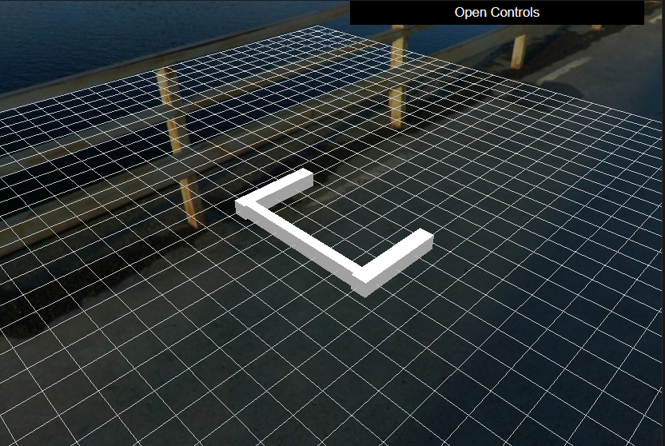

# VACOS: Vehicle-Adjacent Construction Oversight System

**Target:** WACV 2026 | **Status:** Active Development (Phase 1)

## Why This Matters
Construction zones adjacent to active transportation corridors face a critical safety gap: **Visibility-Dependent Failure**. Standard optical sensors (Cameras/LiDAR) fail when obstructed by safety nets, scaffolding, and dust.
**VACOS** addresses this by bridging **Synthetic Aperture Radar (SAR)** sensing with **Geometric Deep Learning**. It introduces a **Physics-Aware Perception System** that "sees through" occlusion using structural inductive biases.

## Reviewer Guide (System Architecture)
Select the Design Document that matches your domain:

### 1. The Master Blueprint (Start Here)
* 👉 **[`docs/design/system_design_overview.md`](./docs/design/system_design_overview.md)**
**Content:** High-Level Architecture, Bottlenecks, Trade-offs, and Engineering KPIs.

### 2. For Embedded Systems
* 👉 **[`docs/design/embedded_system_design.md`](./docs/design/embedded_system_design.md)** *(Planned)*
**Content:** **TinyEngine** implementation, C++ Custom Kernels, Sparsity-Aware Inference.

### 3. For Distributed Systems / MLOps
* 👉 **[`docs/design/distributed_system_design.md`](./docs/design/distributed_system_design.md)** *(Planned)*
**Content:** PyTorch DDP Training, Synthetic Data Pipeline (HDF5).

### 4. For Research / Algorithms
* 👉 **[`docs/design/geometry_aware_perception_system_design.md`](./docs/design/geometry_aware_perception_system_design.md)** *(Planned)*
**Content:** **Geometric Positional Encoding (GPE)**, 17-dim Feature Definitions.

### 5. Evidence & Benchmarks (The Proof)
* 👉 **[`docs/reports/evaluation_results.md`](./docs/reports/evaluation_results.md)** *(Planned)*
**Content:**
* **System:** Memory & Latency Profiling (TinyEngine vs. PyTorch on Jetson Orin).
* **Safety:** Hazard Detection Recall under Heavy Occlusion (SAR vs. Optical).
* **Robustness:** "Performance vs. Occlusion Ratio" degradation curves.

## Tech Stack
* **Simulation:** Python (Trimesh), Open3D Ray-casting
* **Model:** PyTorch, Point Transformer, GPE
* **Embedded:** C++17, CUDA, TinyEngine Concepts
* **Infra:** Docker, WSL2, DDP

---

## 🛠️ Development Log & Visualizations

### Phase 1: Procedural Generation Engine
We are building a Python-based geometry engine to generate 300+ unique construction scenarios.

**Status:** `Task 02: Parametric Frame Generation`
Currently verifying the geometric logic for beam-column connections and auto-fitting algorithms.

*(Fig 1. Automated generation of a portal frame unit using `trimesh` script. Note the precise alignment of the beam between columns.)*